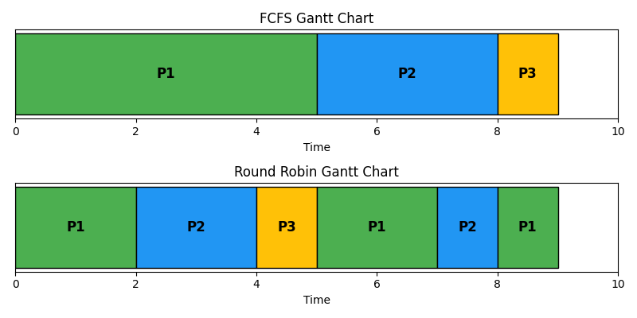

# OS Task Manager Simulation


## Part 1: Process Scheduling

### Scenario
- **P1**: arrives at time 0, burst = 5
- **P2**: arrives at time 1, burst = 3
- **P3**: arrives at time 2, burst = 1

### FCFS (First-Come, First-Served)
#### Gantt Chart
```
| P1 |    P2   | P3 |
0    5    8    9
```
#### Calculations
# OS Task Manager Simulation (Code-Driven)


---

## 🚀 How to Use

1. Run the Python script:
     ```bash
     python os_task_manager.py
     ```
2. All answers, calculations, and Gantt charts are generated and printed in the terminal.
3. Visual Gantt charts are saved as `gantt_charts.png` in the project folder.

---

## 📋 Part 1: Process Scheduling

- **All calculations and Gantt charts are generated by code.**
- Example output:

```
FCFS Gantt Chart:
| P1 | P2 | P3 |
 0    5    8   9
FCFS Waiting Times: [0, 4, 6] Average: 3.33

Round Robin (q=2) Gantt Chart:
| P1 | P2 | P3 | P1 | P2 | P1 |
 0    2    4    5    7    8   9
RR Waiting Times: [4, 4, 2] Average: 3.33
Gantt charts saved as gantt_charts.png
```

---

## 🔒 Part 2: Process Synchronization

- Demonstrates race condition and mutex solution with code.
- Example output:

```
Without synchronization, increments can be lost due to race conditions.
Race condition result (should be 20000): 20000
With mutex: 20000 (correct)
```

---

## 🧠 Part 3: Memory Management

- Simulates FIFO and LRU page replacement, shows page faults and memory state.
- Example output:

```
FIFO Simulation:
Page 1: Fault -> [1]
Page 2: Fault -> [1, 2]
Page 3: Fault -> [1, 2, 3]
Page 2: Hit   -> [1, 2, 3]
Page 4: Fault -> [2, 3, 4]
Page 1: Fault -> [3, 4, 1]
Page 5: Fault -> [4, 1, 5]
LRU Simulation:
Page 1: Fault -> [1]
Page 2: Fault -> [1, 2]
Page 3: Fault -> [1, 2, 3]
Page 2: Hit   -> [1, 2, 3]
Page 4: Fault -> [4, 2, 3]
Page 1: Fault -> [4, 2, 1]
Page 5: Fault -> [4, 5, 1]
FIFO Faults: 6, LRU Faults: 6
Both perform equally in this case.
```

---

## 💽 Part 4: Disk Scheduling

- Simulates FCFS and SSTF, prints head movement and efficiency.
- Example output:

```
FCFS:
53 -> 98 (move 45)
98 -> 183 (move 85)
183 -> 37 (move 146)
37 -> 122 (move 85)
122 -> 14 (move 108)
14 -> 124 (move 110)
124 -> 65 (move 59)
65 -> 67 (move 2)
SSTF:
53 -> 65 (move 12)
65 -> 67 (move 2)
67 -> 37 (move 30)
37 -> 14 (move 23)
14 -> 98 (move 84)
98 -> 122 (move 24)
122 -> 124 (move 2)
124 -> 183 (move 59)
Total head movement - FCFS: 640, SSTF: 236
SSTF is more efficient.
```

---

## 👤 Author

**idrissbado**

---

## 🖼️ Example Gantt Chart Output



---

## Requirements
- Python 3.x
- matplotlib

Install dependencies:
```bash
pip install matplotlib
```

---

## All results, Gantt charts, and calculations are generated by code. For any question, just run the script!
